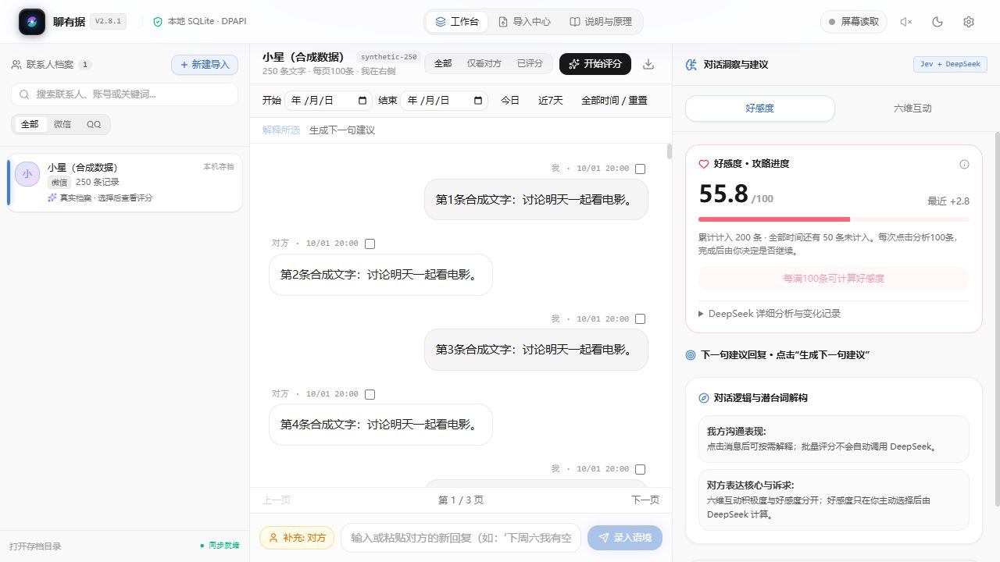
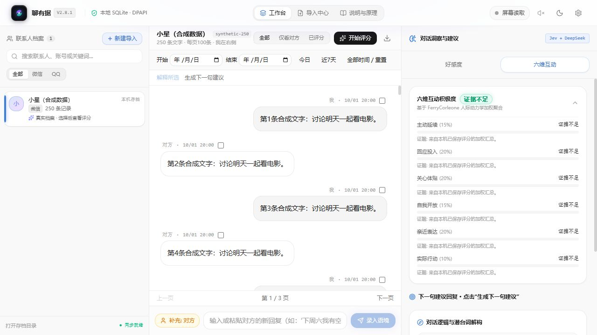
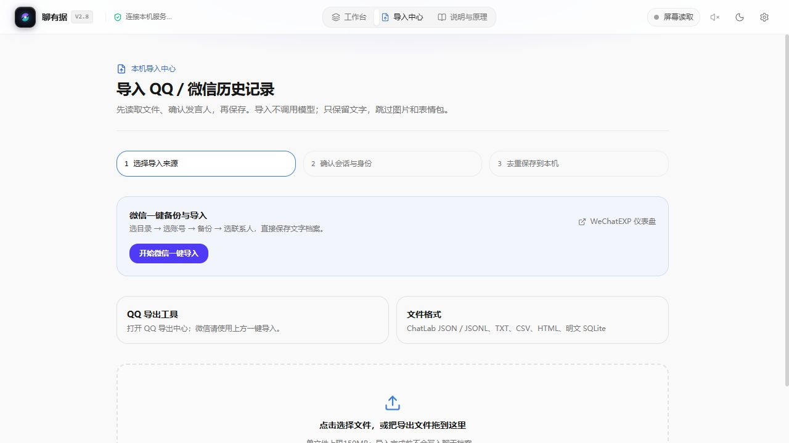

# 聊有据 · QQ / 微信回复助手

[下载 Windows 便携版 v2.8.1](https://github.com/shen6681/chat1/releases/tag/v2.8.1) · [发布说明](docs/releases/v2.8.1.md)

完整解压 `chat1-v2.8.1-windows-x64.zip`，双击 **启动程序.cmd**。无需安装 Python 或 Node.js。默认在浏览器本机端口打开共创者 Yangfan Hu 提交的新版 UI，本机服务只监听 127.0.0.1。无需 WebView2 窗口即可使用完整网页工作台。聊天、评分和设置与原生程序共用，保留已有档案和 Windows DPAPI 密钥。







## 三步开始

1. 设置里选择模型、字体、主题与表达偏好，接口子区域填写自己的 Key，点击保存。空密码框会保留原有已保存密钥；测试连接使用当前草稿，不会替你保存。
2. 微信可在导入中心一键备份与导入：必须自己分别选备份目录和文字导出目录，再选账号、联系人并确认身份。也可选择 JSON / JSONL / TXT / CSV / HTML / SQLite 文件，确认会话和哪位是我，再保存档案。图片和表情包跳过。相同文件可去重；不同导出默认另建档案，需要追加时明确选择已有档案。
3. 工作台选择联系人，用日期选择器或今日 / 近7天 / 全部时间设定范围，点击开始评分。每10条和检查点一起保存；无法判断自动继续，提示所在页码。勾选单条或多条后点解释所选，才请求原因分析。

Jev / 组合模式由 Jev 批量评分，DeepSeek 按需解释或生成回复。建议需自行核对、复制和发送。评分是文字互动线索，不表示对方真实喜欢的概率。长记录每页100条，评分处理所选时间范围的所有记录。

第一次启动会出现可跳过的新手指南，完成或跳过后不再重复；使用说明或 Ctrl+K 可重看。设置集中保存模型、七种字体选项（四款随包OFL字体）、六套主色、五种区块背景、明暗模式、字号及读取与表达偏好。关闭设置会放弃未保存草稿。

**屏幕实时分析、QQ在线读取**：点击右上角“屏幕读取”或导入中心“QQ 导出工具”打开原生功能窗口，选择相同联系人后按原流程操作。微信入口直接打开 WeChatEXP 仪表盘，或使用导入中心的一键向导。实时 OCR 并未伪装为网页监听；原生窗口保留实际框选、OCR和接口功能。

**退出程序**：按 Ctrl+K，选择退出程序；正在返回的批次会先保存。只关闭网页不会停止服务；请在Ctrl+K菜单中选择退出程序。重启后选择联系人，可继续上次评分任务；暂时断连可重连原任务，不重复创建评分请求。

## 源码启动与构建

Python环境安装见下文。仓库已附编译后的 `web/dist`，可运行 `python main.py` 默认打开浏览器；`--native` 为可选 WebView2 窗口；`--desktop` 打开兼容的原 Tk 工具。

修改前端后，在 `web` 运行 `npm ci --ignore-scripts`、`npm test`、`npm run build`，再运行 Python 服务。单独启动 Vite 仅供界面开发，真实功能通过 Python 提供的会话令牌API运行。Windows构建脚本会测试并编译前端，再使用 `scripts/packaging/ChatReplyAssistant.spec` 将前端一并封装进EXE。

## 两种工作模式

| 工作模式 | 用法 |
|---|---|
| 导入记录 | 导入、身份确认、存档、去重、微信文字气泡、自由时间范围、逐条评分、断点续做、范围回复建议、导出 ChatLab JSON |
| 实时分析 | 本地屏幕 OCR，关联所选联系人历史，读取新消息、显示回复建议，按开关续存稳定的新记录 |

联系人档案重启后仍保留。“清空”只清除当前屏幕文字、结果和选区，不删除档案。更换联系人时先暂停，在导入页选择对应档案，再重新框选。主程序不会自动识别当前联系人是否与所选档案一致。

## 内嵌导入中心

| 来源 | 支持方式 |
|---|---|
| 微信 WeChat EXP | 随包的 pc_wechat_exp v2.10.20260928；导入 ChatLab JSON / 带 header/member/message 的 JSONL、TXT、聊天 HTML，仅提取文字 |
| 微信 WeFlow（兼容） | 原有详细 / 紧凑 JSON、CSV / TXT 仍可导入；微信导出页的兼容按钮可连接原本地 API |
| QQ 导出中心 | OneBot HTTP 读取所选好友历史，另存 ChatLab JSON 或直接进入存档预览；QQNT_Export 导出已解密数据库 |
| QQChatExporter | 原生 JSON / JSONL 的 sender + content.text 消息结构；QQ 时间+昵称 TXT 格式 |
| ChatLab | 私聊标准格式，members、messages、ownerId、时间和消息 ID；图片 / 音频等非文本类型跳过 |
| CSV / TSV | 自动匹配 content / 内容、sender / 发送者、isSend / IsSender、时间、会话及消息 ID 字段 |
| 明文 SQLite | 只读打开、选择消息表与字段；微信 3.x MSG 字段自动匹配。加密或压缩内容须先由对应工具转换 |
| 粘贴记录 | 昵称：内容；QQ 时间+昵称+正文；微信昵称、时间和正文分行 |

文件一次最多 150 MB、30 万条文本消息。多个会话会先分开预览；只接受两人私聊。优先按消息 ID 去重，没有 ID 时按时间、发言人、文字及同内容出现次数去重。无时间 / ID 的 TXT、跨格式导出和 OCR 可能有重复或误合并，保存前请核对预览。

**微信导出：** “WeChatEXP 仪表盘”直接打开本机网页；“开始微信一键导入”连接随包官方工具的真实 API。先登录自己的微信，分别主动选择备份目录、文字导出目录（初始为空，无默认地址），选择账号后开始备份，再选择一个私聊。助手用消息 API 分页提取文字并原子写入所选导出目录，预览并确认身份后去重保存档案。群聊及媒体不导入。不会调用上游硬编码默认目录的 export/chat 接口。

为防止上游备份 API 切换目录后保留旧账号状态，备份结果必须匹配所选账号；消息读取使用独立的官方 serve 进程和只含本次目录、账号的隔离配置。原导出工具的密钥、登录配置不复制或修改。备份期间不要在仪表盘启动另一个备份；应用内同时只允许一个微信导入任务。微信备份由工具执行，助手导入阶段只处理文字。

源码仓库不包含第三方导出工具。自行下载后按 [工具安装说明](third_party/README.md) 放在本机 `tools/`，该目录不会提交到 Git。WeChatEXP 该版本上游没有声明许可证，助手的 MIT 许可不覆盖它。已解密数据库仍可使用只读 SQLite 导入；已有 WeFlow 用户可以用兼容入口连接 `http://127.0.0.1:5031`。

## 时间范围、逐条评分与续做

1. 选联系人，点击开始/结束日期打开日历，选择年、月、日并确定，再点击筛选；需要时勾选“精确到时间”选择时分秒。今日、近7天、全部时间会直接筛选，重置恢复全部时间。均按北京时间计算，近7天含今天和前6天，结束日期包括当天；时间未知的记录只在不限时间时包含。导入后已有的精确时间范围仍可恢复使用。
2. 点击“开始评分”，按所选范围的时间顺序处理。通常每次评估10条目标消息，并提供所选范围内此前最多20条文字语境，总文字预算约32000字；单条超过10000字会标记待查看，较长批次会拆成请求后一起保存。模型被要求只使用该条及此前语境。聊天分页只影响显示。
3. 每组保存后显示各条“已分析”，末组不足10条也保存。我方显示 SSS–D 等级和0–100评分，例如 `A · 75/100`；对方显示 `互动变化 +1`、`+0`或负值。证据不足、缺少评分或返回格式错误会记为“无法判断·已继续”，提示所在页，不暂停任务、不补造分数。点击提醒可转到相关页。API认证、额度或网络故障仍停止请求并保留已保存进度。
4. 人物卡展示当前范围已分析内容的六维互动指标；独立好感度卡显示跨范围已保存的关系变化。六维权重参考 FerryCorleone：主动延续 15%、回应投入 20%、关心体贴 20%、自我开放 15%、亲近表达 20%、实际行动 10%；按有证据指标和模型确定度聚合，至少两项有效才给综合分，明确边界会限制进度。点击人物卡可查看指标。
5. 暂停后当前已发出的请求如成功返回，会保存当前组，再停止后续请求。每组最多10条评分、无法判断标记和完成状态在同一 SQLite FULL 同步事务提交；不按每条请求或提交。任务范围与检查点保存在本机，重启后选联系人点击“继续上次任务”，只处理原任务未完成条目。新导入内容另建任务。
6. 默认跳过已有评分或已处理的无法判断记录，即使新开任务也不重复。需重做时从“分析选项”勾选“重新评分已完成记录”。每个联系人有进程任务锁，避免两个窗口同时评分。

尚未收到成功响应或来不及提交本机事务的请求，续做时可能重试；已保存的消息不会再次调用。备份 `archives.sqlite3` 可同时备份聊天文字、评分、问题标记、按需解释和续做任务。

右键消息选择“DeepSeek 解释这一条”；点击气泡多选，再点击“解释所选”。解释仅处理所选消息及有限前文，不重新打分、不改动 Jev 数值，结果保存在本机。再次查看已保存解释不发请求。超过10条选择会分组解释。导入分析与消息解释始终只发送文字，图片和表情包跳过。

“设置”提供本机已安装的微软雅黑、等线、楷体、宋体等字体和10–16聊天字号。选择字体立即预览，点击保存后重启保留；未保存的模型、接口或偏好草稿不用于日常分析。

“档案分析与回复”页的“生成所选范围回复”使用范围内最近最多 40 条、18000 字文字；实时模式保留原有的所选联系人历史摘录机制。

## 独立好感度 / 攻略进度

右侧人物档案分为“好感度”和“六维互动”两页，各显示自己的分数与依据，切换页签不请求模型。

初始值 50，范围 0–100，与 Jev 的六维积极度和逐条互动变化分别保存。不会自动计算：选择联系人和日期后，主动点击人物档案里的“计算好感度”，才调用设置里的 DeepSeek 接口。每次点击仅处理接下来的 100 条尚未计入文字，完成保存后停止；需要继续时再次点击，分析多少组由你决定。不足 100 条留到下次；重叠范围和已完成批次不重复计入。

DeepSeek 结合双方全部文字给出 −10 至 +10 的原始变化、模型自评置信度、详细说明和可核对的原文证据。实际变化 = 原始变化 × 置信度 × 边界系数；正向系数为 min(1,(100−当前值)/50)，负向为 min(1,当前值/50)，再四舍五入至一位并限制在 0–100。缺少双方文字或对方有效原文证据时变化为 0。置信度不是统计校准的概率，好感度仅供理解交流线索。

每组 100 条的变化、前后值及消息归属一起原子保存。长文字完整拆分为子分析，收到的子结果及时保存，聚合每轮严格收敛；暂停、异常和重启后复用已保存结果，全部完成才更新分值。点击“DeepSeek 详细分析与变化记录”查看依据；其他评分仍每 10 条保存。未成功返回或尚未落盘的请求可能重试。

## QQ 导出中心

进入“导入记录 → QQ 导出中心”，有两个入口：

**在线读取 QQ 记录（没有已解密数据库时使用）：**

1. 已有 NapCat / LLOneBot 时使用原有连接器；否则自行安装连接器，点击“打开 QQ 连接器”可尝试启动本机 `tools/QQChatExporter` 下的启动脚本。连接器只提供记录接口，导出由助手完成。
2. 在连接器管理页的网络配置中，新建并启用 **HTTP 服务端**，监听地址 `127.0.0.1`、端口 `3000`，设置 HTTP Token。也可以使用其他本机端口。
3. 回到导出中心，填写 `http://127.0.0.1:3000` 和相同的 HTTP Token，点击“连接并加载好友”。这里需要的是 OneBot HTTP 接口；NapCat WebUI 通常使用 `6099`，WebUI 登录密码与 HTTP Token 也是两个设置。
4. 选择一个好友，点击“读取所选聊天”。然后“另存为 JSON”，或“预览并导入存档”，确认哪位是我再保存。读取不会自动调用模型。

“连接设置说明”提供内嵌步骤和 [NapCat 官方配置文档](https://napneko.github.io/config/basic)。只登录 QQ / WebUI 不会自动启用记录接口。主程序只调用登录信息、好友列表和私聊历史三个读取接口，不发送消息。

每次可读取最多 30000 条文本，分页、去重、支持取消；后续翻页失败会明确标记为部分历史。连接器能返回哪些记录取决于 QQ / 连接器版本及本机可用历史，不保证涵盖云端或其他设备的全部记录。图片、音频等非文本消息跳过。

**QQNT 数据库导出（已有解密副本时使用）：**

随包提供 [QQNT_Export v3.3.0](https://github.com/Tealina28/QQNT_Export/releases/tag/v3.3.0)，该版本在上游标记为预发布版。它的用途是读取并导出**已经解密的 QQNT 数据库**，无需登录。选择包含 `nt_msg.db` 的已解密数据库副本目录，保留同目录的相关数据库（例如 `profile_info.db`），指定输出目录和可选 QQ 号筛选，点击“导出私聊 JSON”。完成后选择一个私聊文件，直接进入导入预览。

本程序不提取 QQ 数据库密钥、不解密原始数据库。加密 `nt_msg.db` 会在启动导出器之前被拒绝；可查看 [QQDecrypt 数据库准备文档](https://qqbackup.github.io/QQDecrypt/)，或使用在线读取页。不同数据库版本可能需要上游适配。

从源码运行时需自行安装 QQNT_Export；下载地址、放置路径和校验值见 [工具安装说明](third_party/README.md)。已有连接器仍可使用。升级保留当前连接器配置、API 设置与已有联系人档案。

## 支持的模型

| 模式 | Key | 行为 |
|---|---|---|
| DeepSeek | DeepSeek 或兼容 Chat Completions 的服务 | 分析逻辑、生成逐句标签和新的回复建议 |
| TypeSafe Jev | TypeSafe | 原生分类、评分、概率；依据表达方向提供预设回复，**不生成新句子** |
| Jev + DeepSeek | 批量评分只需 TypeSafe Key；解释/生成需文字接口 Key | 档案评分只调用 Jev；DeepSeek 按需解释所选消息，实时模式生成回复 |

默认接口已按官方文档设置：

- DeepSeek：`https://api.deepseek.com`，模型 `deepseek-flash`，请求 `/chat/completions`。可将地址改为带 `/v1` 的兼容服务地址，或完整的 Chat Completions endpoint。
- TypeSafe：`https://api.typesafe.ai`，模型 `jev-latest`，请求 `/v1/systemone`。这是独立的原生决策协议，**不是** Chat Completions。
- 模型名和地址均可编辑。Key 必须来自相应服务商；本程序不自带账号或额度。
- 图片辅助默认关闭。开启后，文字模型会收到**所选区域**截图，可结合气泡和表情分析；模型必须支持图片。Jev 始终只收到 OCR 文字。
- “JSON 模式”默认开启，部分兼容服务不支持时可关闭。模型必须能够返回规定的分析 JSON。
- 不提供 Vercel / OpenRouter 的 Jev 专用网关协议适配。它们不是本程序 TypeSafe 地址栏可直接替换的 Chat Completions 服务。

## 功能和范围

- 默认每 2 秒读取屏幕。两次 OCR 原文一致后才触发自动分析，请求开始时间至少相隔 8 秒。
- 未变化的成功分析不重复请求；新消息到来后清除旧建议；接口失败暂停自动分析，避免持续消耗额度。
- 后台线程处理 OCR / 网络请求，界面可继续操作。点击暂停后不再发起新请求，组合模式也会停止下一阶段；已经提交到服务端的请求可能仍会完成。
- 选区绑定窗口，移动时跟随。窗口尺寸变化需要重新选择；关闭、最小化或常见遮挡时暂缓读取。
- 遮挡保护抽查选区的 9 个点，无法覆盖所有小面积遮挡；请保持聊天区无遮挡，并查看预览。切换聊天对象时请停止、清空并重新框选。
- 每轮分析最新最多 40 条、18000 字；逐句情绪和意图展示最新 6 条、各最多 3 项。关联档案后，从最近 800 条历史候选中选取最近及相关摘录，额外文字预算约 12000 字。不会把整份长档案一次性送入模型，也不声称已分析未提供的全部历史。
- “新消息续存档案”开启且已选档案时，两次相同 OCR 后按连续重叠合并新消息。OCR 记录没有原始时间 / 消息 ID，保存的时间为读取时间；未确认发言人的快照不续存。仅保存屏幕可见消息，不自动滚动聊天窗口。
- 双方表达逻辑、六项互动指标、最近我方回复 SSS–D 评级、等待提示、三条回复和 Markdown 报告导出。
- 自定义目标与回复风格，可关闭自动分析，先本地识别、校对再单次分析。
- 聊天气泡位置只是说话人推测。长气泡、昵称、表情、图片和客户端主题可能影响识别；无法确定的说话人标为“未确认”。
- 主程序使用屏幕 OCR 和只读文件 / 本地 API 导入，不直接解密客户端原数据库或自动发送回复。

## 如何看待“好感度”

导入聊天页显示 **攻略进度**，实时页保留 **互动积极度**，均参照主动延续、回应投入、关心体贴、自我开放、亲近表达和实际行动六维文字线索。不是喜欢你的概率，也不是对一个人的评价。缺少相关证据时显示“证据不足”，不补造分数；明确拒绝会限制综合信号并提示尊重边界。

Jev 的逐句概率和确定度来自其原生返回；DeepSeek 单独模式的概率是模型自评。两者都可能出错，也不了解聊天之外的情况。图片辅助只解释聊天视觉线索，不从脸、头像或外貌推测好感。

Jev 单独模式的回复是本地预设表达，通常还需要按具体问题修改；要获得针对语境的新回复，请用 DeepSeek 或组合模式。

## 数据与密钥

- OCR、导入与存档在本机执行。档案评分在 Jev / 组合模式只向 Jev 发文字；按需解释才向文字接口发所选消息及有限前文。实时组合模式向两家发送有限语境。**导入本身不调用模型，本地运行不等于离线模型分析。**
- 联系人档案以明文 SQLite 保存于 `%LOCALAPPDATA%\ChatReplyAssistant\archives.sqlite3`，重启后继续使用；可从程序打开目录备份。截图和未关联档案的临时聊天保留在内存。“清空”不删除历史档案。“导出档案 / 报告”会另存含原文的文件。
- 配置保存在 `%LOCALAPPDATA%\ChatReplyAssistant\settings.json`。勾选“记住 API Key”时用当前 Windows 用户的 DPAPI 加密，配置没有明文 Key。
- 取消记住密钥并保存会移除磁盘上的加密 Key。也可通过 `DEEPSEEK_API_KEY` / `TYPESAFE_API_KEY` 环境变量注入。
- 接口错误只显示 HTTP 状态与本地说明，不显示可能回显聊天内容或密钥的服务商错误正文。远程地址要求 HTTPS，禁止携带认证信息跨 HTTP 重定向；本地 mock 测试允许 loopback HTTP。

## 验证情况

本地测试覆盖中文OCR、导入/导出、身份确认、时间范围、真实进程中断、并发锁、批次原子回滚、10/10/3保存、无法判断自动继续与跳过、网络中断续做、按需多选解释保存且不覆盖评分、草稿不生效与设置保存。普通及最小窗口的聊天、设置和问题提醒均做合成数据视觉检查，具体通过数量见 VERSION.json。

API 请求使用本地 mock 服务，**没有用真实账号调用 DeepSeek、TypeSafe，也没有登录 QQ 或读取私人聊天做验证**。WeChat EXP 官方 EXE 哈希已核对，启动按钮用 mock 验证，未运行其备份或密钥扫描来测试；真实 QQ / 微信历史兼容性仍取决于用户客户端和导出器。

打包后的 EXE 提供中文 OCR / DPAPI / 导入存档续存的离线自测；所有自测使用合成记录。

不同 QQ / 微信版本、缩放、主题和多显示器配置尚未全面实测。只用程序生成的聊天样例验证 OCR；没有读取此设备上的私人聊天。屏幕位置检测不代表所有客户端兼容性都已确认。

## 从源码运行 / 打包

推荐 Python 3.12，Windows x64。导出器需要先按 [本机工具安装说明](third_party/README.md) 放入 `tools/`；普通文件导入、在线 QQ 读取和分析功能不依赖这两个 EXE。首次运行：

```powershell
Set-Location D:\ChatReplyAssistant
powershell -ExecutionPolicy Bypass -File .\setup.ps1
.\.venv\Scripts\python.exe main.py
```

测试与打包：

```powershell
.\.venv\Scripts\python.exe -m unittest discover -s tests -v
powershell -ExecutionPolicy Bypass -File .\build.ps1
```

便携包自测（只使用合成中文图片和虚构密钥，不读取屏幕或调用网络）：

```powershell
Start-Process -FilePath .\dist\ChatReplyAssistant.exe -ArgumentList '--self-test', 'self-test.json' -WindowStyle Hidden -Wait
Get-Content .\self-test.json
```

仓库目录：`chat_assistant/` 是 Python 应用，`web/` 是前端，`tests/` 是测试，`assets/` 只放运行资源，`docs/images/` 放文档截图，`scripts/` 放构建与维护脚本，`third_party/` 只记录工具安装信息。`tools/`、`.runtime/` 和 `.venv/` 是本机目录，不提交到 Git。版本测试记录由 CI 或发行附件保存，不进入源码目录。

## 参考

功能参考 [FerryCorleone/crush-monitor](https://github.com/FerryCorleone/crush-monitor) 的逐句情绪 / 意图、六维互动线索和回复评级。本程序为独立 Python 桌面实现，增加选区 OCR、实时读取、DeepSeek 生成和悬浮建议。

- [DeepSeek 官方 API](https://api-docs.deepseek.com/)
- [DeepSeek 模型说明](https://api-docs.deepseek.com/quick_start/pricing/)
- [TypeSafe 原生接口文档](https://api.typesafe.ai/docs)
- [TypeSafe OpenAPI schema](https://api.typesafe.ai/openapi.json)
- [Jev 官方介绍](https://typesafe.ai/blog/introducing-system-one-models-and-jev)
- [OpenAI 图片输入格式](https://developers.openai.com/api/docs/guides/images-vision)
- [RapidOCR](https://github.com/RapidAI/RapidOCR)
- [ChatLab 导出格式标准](https://github.com/ChatLab/ChatLab/blob/main/docs/cn/standard/chatlab-format.md)
- [WeFlow HTTP API 文档](https://github.com/hicccc77/WeFlow/blob/main/docs/HTTP-API.md)
- [QQChatExporter](https://github.com/shuakami/qq-chat-exporter)
- [QQNT_Export](https://github.com/Tealina28/QQNT_Export)
- [WeChat EXP / pc_wechat_exp](https://github.com/sunhanaix/pc_wechat_exp)
- [NapCat OneBot HTTP 配置](https://napneko.github.io/config/basic)

与腾讯、微信、QQ、DeepSeek、TypeSafe 及参考项目作者没有隶属关系。依赖许可证见 `THIRD_PARTY_NOTICES.md`。
